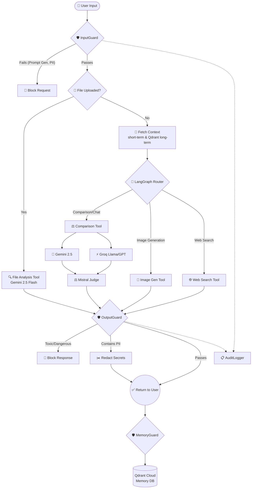

# 🧠 AGENT_MIND / Neuroplexa AI

[](https://www.python.org/downloads/)
[](https://streamlit.io)
[](https://opensource.org/licenses/MIT)

**Built by Sounak**

An advanced, production-ready multi-tool AI agent built with **Streamlit** and **LangGraph**. This application serves as a robust agentic framework that can search the web, generate images, perform comparative analysis between LLMs (with MoA judging), and analyze user-uploaded files. It is backed by a native high-security execution layer, active audit logging, and a long-term cross-device vector memory system.

---

## ⚙️ Architecture & Workflow

The system is built to safely and intelligently route requests using a state machine. It has two main execution paths: the **Agent Workflow** for chat and the **Direct Workflow** for file analysis.

Below is the complete execution architecture:



---

## ✨ Core Features

### 1. 🤖 Dynamic Agentic Router (LangGraph)
At the heart of AGENT_MIND is a central intelligent router powered by Google Gemini. The router analyzes the user's intent to dynamically select the best tool for the job. It utilizes both a rolling short-term conversation window and long-term context fetched from the vector database.

### 2. ⚖️ Mixture of Agents (MoA) Comparison Engine
When a general query or coding task is submitted, the system queries two different cutting-edge models simultaneously:
- **Google's Gemini 2.5 Flash**
- **Groq API** (Automatically routing to GPT-OSS 120B or Llama-3.1-8b based on query complexity)

Once both models answer, a third impartial AI judge (**Mistral AI**) evaluates both responses against the user's context, declares a winner, and explains its reasoning.

### 3. 🛡️ Native Security Layer
A custom-built `security_guard.py` ensures enterprise-grade safety:
- **Input Guard:** Drops prompt injections, detects gibberish (keyboard smashing), enforces length limits, and prevents context-flooding attacks.
- **Output Guard:** Pre-screens AI responses. It blocks toxic or harmful instructions and automatically strips and redacts personal identifiable information (PII) before it is shown to the user. Supported PII detection includes credit cards, Aadhaar, PAN, Emails, Phone numbers, and API Hash keys (`[REDACTED:GROQ_KEY]`).
- **Audit Logger:** All security catches are securely logged directly into a Qdrant audit vector collection using dummy vectors, preserving an unchangeable trail for the Security Dashboard.

### 4. 🧠 Long-Term Semantic Vector Memory
AGENT_MIND features persistent cross-device memory powered by **Qdrant Cloud** and the `sentence-transformers/all-MiniLM-L6-v2` embedding model.
- Conversations are embedded and stored in real-time.
- Next time you chat, the system semantically searches Qdrant for past memories related to the current query.
- Secure, tokenized `session_ids` computed via SHA-256 (Name + PIN) ensure memories are securely partitioned across multiple devices without storing PII.
- Memory content is filtered through the **MemoryGuard** before storage to ensure API keys or passwords never leak into the vector DB.

### 5. 🌐 Web Search & 🎨 Image Generation
- Integrates the **Tavily API** for real-time live internet crawling. Search results are fed through Gemini to synthesize a complete and accurate answer.
- Integrates **Pollinations AI**. When the user asks to draw an image, the prompt is intercepted, rewritten by Gemini into an expert-level generation prompt (focusing on lighting, aesthetics, and technicals), and then sent to Pollinations for high-quality generation.

### 6. 📂 File Analysis Expert
Upload `.py`, `.js`, `.txt`, `.html`, or `.pdf` files.
- Operates on a secondary path bypassing the general multi-tool router.
- Includes a built-in optical character recognition (OCR) fallback using `pytesseract` and `fitz` for PDFs that lack a text layer.
- Assumes an "Expert Persona" to review code, summarize documents, or answer deep technical questions about the file.

---

## 🚀 Getting Started

Follow these instructions to set up and run the project locally.

### 1. Prerequisites

-   Python 3.9+
-   Git
-   Tesseract OCR (Optional, required for the OCR PDF fallback feature)

### 2. Clone the Repository

```bash
git clone https://github.com/sounakss7/AGENT_MIND.git
cd AGENT_MIND
```

### 3. Set Up a Virtual Environment

It is highly recommended to use a virtual environment to manage dependencies.

```bash
# For Windows
python -m venv venv
.\venv\Scripts\activate

# For macOS/Linux
python3 -m venv venv
source venv/bin/activate
```

### 4. Install Dependencies

Install the necessary pip packages. 

```bash
pip install -r requirements.txt
```

### 5. Configure API Keys

The application uses Streamlit Secrets for managing API keys securely.

1.  Create a folder named `.streamlit` in your project's root directory.
2.  Inside this folder, create a file named `secrets.toml`.
3.  Add your API credentials as follows:

```toml
# .streamlit/secrets.toml

# LLM Providers
GOOGLE_API_KEY = "YOUR_GOOGLE_KEY"
GROQ_API_KEY = "YOUR_GROQ_KEY"
MISTRAL_API_KEY = "YOUR_MISTRAL_KEY"

# Tools
TAVILY_API_KEY = "YOUR_TAVILY_KEY"
POLLINATIONS_TOKEN = "YOUR_POLLINATIONS_TOKEN"

# Qdrant Vector Memory
QDRANT_URL = "YOUR_QDRANT_CLUSTER_URL"
QDRANT_API_KEY = "YOUR_QDRANT_API_KEY"
```

## ▶️ How to Run the Application

Once your virtual environment is active and keys are set, run the app using Streamlit:

```bash
streamlit run app.py
```

The application will launch in your default web browser (typically at `http://localhost:8501`). Look for the Sidebar to set your unique Memory ID and PIN!
