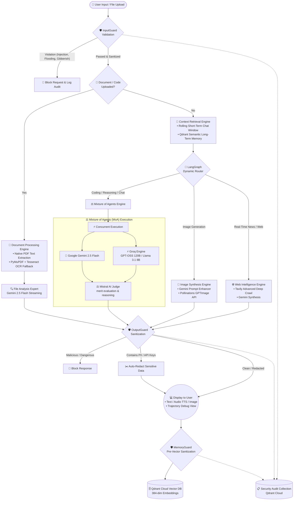

# 🧠 AGENT_MIND / Neuroplexa AI

<div align="center">

[](https://www.python.org/downloads/)
[](https://streamlit.io)
[](https://github.com/langchain-ai/langgraph)
[](https://qdrant.tech/)
[](https://opensource.org/licenses/MIT)

**An enterprise-grade, multi-model agentic AI ecosystem featuring dynamic LangGraph routing, Mixture of Agents (MoA) competitive evaluation, cross-device semantic vector memory, multi-tier zero-trust security guardrails, and multimodal capabilities.**

*Built with ❤️ by **Sounak***

[Key Features](#-key-features) • [System Architecture](#-system-architecture) • [Security & Guardrails](#-enterprise-security--zero-trust-guardrails) • [Vector Memory](#-persistent-semantic-vector-memory) • [Getting Started](#-getting-started) • [Configuration](#-configuration--secrets-setup) • [Project Structure](#-project-structure)

</div>

---

## 📖 Executive Summary

**AGENT_MIND (Neuroplexa AI)** is an advanced, production-ready AI agent application designed to provide intelligent reasoning, multimodal task execution, and unbreakable data privacy.

Unlike single-model chatbots, AGENT_MIND employs a **state-machine routing architecture** that dynamically dispatches user intents to specialized tools. When complex reasoning or coding is required, it triggers a **Mixture of Agents (MoA)** system where multiple leading LLMs (Google Gemini 2.5 Flash and Groq's high-speed engines) generate responses in parallel, and an impartial **Mistral AI Judge** evaluates the outputs to select the highest-quality answer.

Every transaction is protected by a native, zero-dependency **Security Guard layer** that prevents prompt injections, sanitizes inputs, redacts sensitive Personal Identifiable Information (PII) and API keys, and logs telemetry to a dedicated audit vector database.

---

## ⚙️ System Architecture

AGENT_MIND separates workloads into two distinct execution pathways: the **Interactive Agent Workflow** (governed by LangGraph) and the **Direct Document Analysis Pipeline** (optimized for deep document parsing and OCR).


```mermaid
flowchart TD
    User([🧑 User Input / File Upload]) --> InputGuard{🛡️ InputGuard\nValidation}
    
    %% Input Security Validation %%
    InputGuard -- "Violation (Injection, Flooding, Gibberish)" --> Block[🚫 Block Request & Log Audit]
    InputGuard -- "Passed & Sanitized" --> CheckFile{📂 Document / Code\nUploaded?}
    
    %% Document Direct Pipeline %%
    CheckFile -- Yes --> FilePipeline[📄 Document Processing Engine\n• Native PDF Text Extraction\n• PyMuPDF + Tesseract OCR Fallback]
    FilePipeline --> FileAnalysis[🔍 File Analysis Expert\nGemini 2.5 Flash Streaming]
    
    %% LangGraph Agent Pipeline %%
    CheckFile -- No --> ContextEngine[🧠 Context Retrieval Engine\n• Rolling Short-Term Chat Window\n• Qdrant Semantic Long-Term Memory]
    ContextEngine --> Router{🤖 LangGraph\nDynamic Router}
    
    %% Router Branches %%
    Router -- "Coding / Reasoning / Chat" --> MoABranch[⚖️ Mixture of Agents Engine]
    Router -- "Image Generation" --> ImageBranch[🎨 Image Synthesis Engine\n• Gemini Prompt Enhancer\n• Pollinations GPTImage API]
    Router -- "Real-Time News / Web" --> WebBranch[🌐 Web Intelligence Engine\n• Tavily Advanced Deep Crawl\n• Gemini Synthesis]
    
    %% MoA Sub-Workflow %%
    subgraph MoA ["⚖️ Mixture of Agents (MoA) Execution"]
        direction TB
        ParallelExec[⚡ Concurrent Execution]
        ParallelExec --> ModelA[🧠 Google Gemini 2.5 Flash]
        ParallelExec --> ModelB[⚡ Groq Engine\nGPT-OSS 120B / Llama 3.1 8B]
        ModelA & ModelB --> MistralJudge[⚖️ Mistral AI Judge\nmerit evaluation & reasoning]
    end
    MoABranch --> ParallelExec
    
    %% Aggregation & Output Guarding %%
    FileAnalysis & MistralJudge & ImageBranch & WebBranch --> OutputGuard{🛡️ OutputGuard\nSanitization}
    
    %% Output Validation %%
    OutputGuard -- "Malicious / Dangerous" --> BlockResponse[🚫 Block Response]
    OutputGuard -- "Contains PII / API Keys" --> Redact[✂️ Auto-Redact Sensitive Data]
    OutputGuard -- "Clean / Redacted" --> UserDisplay((💻 Display to User\n• Text / Audio TTS / Image\n• Trajectory Debug View))
    Redact --> UserDisplay
    
    %% Memory Ingestion %%
    UserDisplay --> MemoryGuard{🛡️ MemoryGuard\nPre-Vector Sanitization}
    MemoryGuard --> QdrantDB[(🗄️ Qdrant Cloud Vector DB\n384-dim Embeddings)]
    
    %% Security Telemetry %%
    InputGuard -.-> AuditDB[(📋 Security Audit Collection\nQdrant Cloud)]
    OutputGuard -.-> AuditDB
    MemoryGuard -.-> AuditDB
```

---

## ✨ Key Features

### 1. 🤖 LangGraph Dynamic Intent Router
- Built upon a declarative state graph (`StateGraph`).
- Employs **Google Gemini 2.5 Flash** as the master router.
- Combines immediate short-term history with semantically matched long-term context to accurately classify user intents into:
  - **`comparison_chat`**: Technical analysis, algorithm design, coding, creative writing, and general conversation.
  - **`image_generator`**: Explicit image creation and graphic synthesis prompts.
  - **`web_search`**: Current events, live sports, stock updates, news, and real-time facts.

### 2. ⚖️ Mixture of Agents (MoA) & Judge Engine
- **Parallel Multi-Model Execution**: Concurrently queries multiple models via Python's `ThreadPoolExecutor`:
  - **Google Gemini 2.5 Flash** (via LangChain Generative AI).
  - **Groq API**: Dynamically selects between `openai/gpt-oss-120b` (for complex logic, code, mathematics, and NLP reasoning) and `llama-3.1-8b-instant` (for rapid conversational queries).
- **Impartial Evaluation**: **Mistral AI** (`mistral-small-latest`) acts as the presiding judge, scoring both responses against the user query and historical context, choosing the definitive winner, and articulating its justification.

### 3. 🧠 Long-Term Semantic Vector Memory
- **Vector Database**: Hosted on **Qdrant Cloud** with a 384-dimensional cosine distance collection (`agent_mind_memory`).
- **Embeddings**: Generated using `sentence-transformers/all-MiniLM-L6-v2` with normalized vectors.
- **Cross-Device Session Partitioning**: Employs deterministic SHA-256 hashed session identifiers `(Name + PIN)`. Users can access their unified memory space across any device without storing plaintext credentials.
- **Intelligent Semantic Recall**: Automatically embeds queries, applies session filters, and retrieves top relevant historical turns with cosine similarity scoring (threshold $\ge 0.35$).

### 4. 📄 Deep Document Ingestion & OCR Engine
- Supports `.pdf`, `.txt`, `.py`, `.js`, `.html`, and `.css` files.
- **Dual-Layer Extraction**:
  - Direct digital stream parsing via `PyPDF2`.
  - Fallback Optical Character Recognition (OCR) powered by `PyMuPDF` (`fitz`) and `pytesseract` for scanned or image-only documents.
- **Streaming Persona**: Gemini 2.5 Flash assumes a senior multidisciplinary expert persona with real-time token streaming.

### 5. 🎨 Two-Stage Image Generation
- **Prompt Optimization**: A specialized Gemini 2.5 Flash prompt engineer rewrites concise user prompts into rich, photographic/artistic prompts detailing subject, style, lighting, and composition.
- **Rendering & Delivery**: Pollinations AI (`gptimage` model) synthesizes the image, which is displayed in-app alongside download utilities.

### 6. 🌐 Live Web Intelligence
- Integrates the **Tavily AI Search API** for advanced, deep web scraping.
- Aggregates top search snippets and feeds them into Gemini 2.5 Flash to synthesize factual, citation-backed answers.

### 7. 🎙️ Multimodal Text-to-Speech (TTS) & Interactive Utilities
- **One-Click Audio Narration**: Integrates Google Text-to-Speech (`gTTS`) to synthesize clear spoken audio from any assistant message.
- **Clipboard Integration**: Embedded custom JavaScript copy buttons with feedback states.
- **Trajectory Debugger**: Inspect complete LangGraph execution traces, step-by-step inputs, and node outputs.

---

## 🛡️ Enterprise Security & Zero-Trust Guardrails

AGENT_MIND features a robust, multi-layer security architecture implemented in [`security_guard.py`](file:///c:/Users/Administrator/Desktop/CODE/AGENT_MIND/security_guard.py):

| Guard Component | Responsibility | Action Taken |
| :--- | :--- | :--- |
| **`make_session_id`** | Generates SHA-256 identity hash from `Name + PIN` | Zero PII stored in DB; cross-device access with cryptographic security. |
| **`InputGuard`** | Scans queries before reaching the LangGraph router | • Rejects context-flooding attacks ($> 3000$ chars)<br>• Strips null bytes and control chars<br>• Detects keyboard spam & statistical gibberish (avg word length $> 18$)<br>• Blocks jailbreak/DAN attacks, system prompt leakage, token overrides |
| **`OutputGuard`** | Pre-screens model output before UI rendering | • Auto-redacts PII & API keys (`[REDACTED:<TYPE>]`)<br>• Blocks harmful/toxic instructions (weapons, exploits, malicious code) |
| **`MemoryGuard`** | Pre-screens data before vector embedding in Qdrant | Prevents sensitive keys, tokens, or PII from polluting vector memory. |
| **`AuditLogger`** | Security telemetry tracking in Qdrant collection | Logs all events (`INFO`, `WARN`, `BLOCK`) with timestamps and pattern findings. |

### Auto-Redacted PII & Secret Signatures

```
• Email Addresses              • Aadhaar Numbers (India)
• Phone Numbers (India & Intl)  • PAN Cards (India)
• Credit / Debit Card Numbers   • Google API Keys (AIza...)
• Groq API Keys (gsk_...)       • OpenAI API Keys (sk-...)
• AWS Access Keys (AKIA...)     • GitHub Tokens (ghp_...)
• IPv4 Addresses
```

---

## 📊 Interactive UI & Dashboards

The application is structured into three primary tabs:

```
┌────────────────────────────────────────────────────────────────────────┐
│                        🧠 Neuroplexa AI Workspace                      │
├───────────────────────┬────────────────────────┬───────────────────────┤
│        💬 Chat        │       📜 History       │      🔒 Security      │
├───────────────────────┴────────────────────────┴───────────────────────┤
│  • Streaming responses • Grouped by date        • Real-time threat log │
│  • MoA Judged Output   • Keyword search         • Severity breakdowns  │
│  • Audio TTS player    • 1-Click reload         • Injections blocked   │
│  • Image generation    • Tool category badges   • Event distributions  │
│  • Execution trace     • Message metrics        • Filterable audit log │
└────────────────────────────────────────────────────────────────────────┘
```

---

## 📁 Project Structure

```
AGENT_MIND/
├── .streamlit/
│   ├── config.toml              # Streamlit theme & UI configurations
│   └── secrets.toml             # API credentials & keys (Git-ignored)
├── agent.py                     # LangGraph workflow, MoA judging, agent tools
├── app.py                       # Main Streamlit application & interactive UI
├── security_guard.py            # Zero-trust security guards, PII redaction, audit logging
├── vector_memory.py             # Qdrant Cloud semantic memory & embedding pipeline
├── packages.txt                 # OS-level dependencies (tesseract-ocr)
├── requirements.txt             # Python dependencies
├── updated_architecture.md      # Workflow & architecture mermaid documentation
└── README.md                    # Project documentation
```

---

## 🚀 Getting Started

### 1. Prerequisites

- **Python**: Version `3.9` or higher
- **Git**: Version `2.x`+
- **Tesseract OCR** *(Optional, required for OCR on scanned PDFs)*:
  - **Windows**: Download installer from [UB-Mannheim/tesseract](https://github.com/UB-Mannheim/tesseract/wiki) and add to `PATH`.
  - **Linux (Ubuntu/Debian)**: `sudo apt-get install tesseract-ocr`
  - **macOS**: `brew install tesseract`

### 2. Clone the Repository

```bash
git clone https://github.com/sounakss7/AGENT_MIND.git
cd AGENT_MIND
```

### 3. Create & Activate Virtual Environment

```bash
# Windows (PowerShell)
python -m venv .venv
.\.venv\Scripts\Activate.ps1

# macOS / Linux
python3 -m venv .venv
source .venv/bin/activate
```

### 4. Install Dependencies

```bash
pip install --upgrade pip
pip install -r requirements.txt
```

---

## 🔑 Configuration & Secrets Setup

AGENT_MIND reads API credentials securely from Streamlit Secrets or Environment Variables.

A complete example template is provided at `.streamlit/secrets.toml.example`. Simply copy it to configure your local environment:

```bash
cp .streamlit/secrets.toml.example .streamlit/secrets.toml
```

Edit `.streamlit/secrets.toml`:

```toml
# .streamlit/secrets.toml

# ── Primary LLM & Routing ─────────────────────────────────────
GOOGLE_API_KEY = "your_google_gemini_api_key_here"

# ── Mixture of Agents (MoA) Engines ───────────────────────────
GROQ_API_KEY = "your_groq_api_key_here"
MISTRAL_API_KEY = "your_mistral_api_key_here"

# ── Multimodal & Web Intelligence Tools ────────────────────────
TAVILY_API_KEY = "your_tavily_search_api_key_here"
POLLINATIONS_TOKEN = "your_pollinations_api_token_here"

# ── Vector Memory & Security Telemetry (Qdrant Cloud) ─────────
QDRANT_URL = "https://your-cluster-id.region.qdrant.tech:6333"
QDRANT_API_KEY = "your_qdrant_cloud_api_key_here"

# ── Security & Authentication ─────────────────────────────────
AUTH_PEPPER = "your-high-entropy-server-pepper-secret"
ADMIN = false
```

### Obtaining Free API Keys:
| Service | Purpose | URL |
| :--- | :--- | :--- |
| **Google AI Studio** | Gemini 2.5 Flash Routing & LLM | [aistudio.google.com](https://aistudio.google.com/) |
| **Groq Cloud** | High-speed Llama-3.1 & GPT-OSS inference | [console.groq.com](https://console.groq.com/) |
| **Mistral AI** | Impartial MoA Judge Model | [console.mistral.ai](https://console.mistral.ai/) |
| **Tavily AI** | Deep search web retrieval | [tavily.com](https://tavily.com/) |
| **Pollinations AI** | AI image synthesis | [pollinations.ai](https://pollinations.ai/) |
| **Qdrant Cloud** | Managed vector database (1GB free tier) | [cloud.qdrant.io](https://cloud.qdrant.io/) |

---

## ▶️ Running the Application

Launch the Streamlit dashboard:

```bash
streamlit run app.py
```

Once started, open your browser at **`http://localhost:8501`**.

### Quick Start Tips:
1. **Set your Identity**: Enter your Name and an optional PIN in the sidebar to initialize your persistent memory.
2. **Chat & Code**: Ask questions or request code solutions to see the **Gemini vs Groq** comparison judged live by **Mistral**.
3. **Generate Images**: Type `"Draw a futuristic cyberpunk cityscape at night"` to trigger the two-stage visual synthesis.
4. **Search the Web**: Type `"What is the latest news regarding SpaceX launches?"` to trigger real-time search synthesis.
5. **Inspect Security**: Switch to the **🔒 Security** tab to view your audit log and threat intelligence telemetry.

---

## 🛠️ Technology Stack

| Category | Technology |
| :--- | :--- |
| **Frontend & UI** | Streamlit, Custom HTML5/CSS3 animations, JavaScript Clipboard API |
| **Agent Orchestration** | LangGraph, LangChain Core |
| **LLM Inference** | Google Gemini 2.5 Flash, Groq (GPT-OSS 120B & Llama 3.1 8B), Mistral Small |
| **Vector Database** | Qdrant Cloud Client |
| **Embedding Model** | `sentence-transformers/all-MiniLM-L6-v2` |
| **Document Processing** | PyMuPDF (`fitz`), PyPDF2, Tesseract OCR (`pytesseract`) |
| **Multimodal Tools** | Google Text-to-Speech (`gTTS`), Pollinations AI, Pillow (`PIL`) |
| **Web Crawling** | Tavily Search Python SDK |

---

## 🤝 Contributing

Contributions are welcomed! Follow these steps to contribute:

1. Fork the repository.
2. Create a feature branch: `git checkout -b feature/awesome-feature`
3. Commit your changes: `git commit -m "feat: add awesome feature"`
4. Push to your branch: `git push origin feature/awesome-feature`
5. Open a Pull Request.

---

## 📜 License

This project is licensed under the **MIT License** - see the [LICENSE](LICENSE) file for details.
