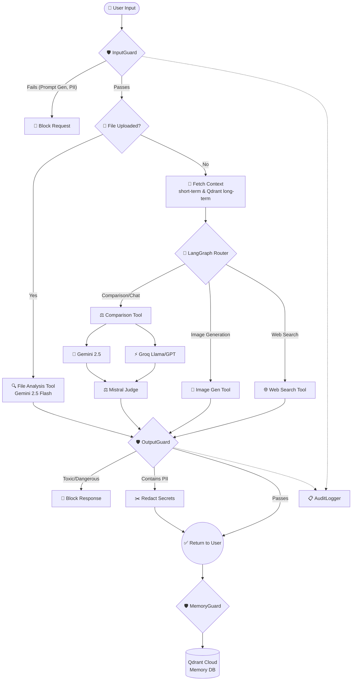

```mermaid
flowchart TD
    User([🧑 User Input]) --> InputGuard{🛡️ InputGuard}
    
    %% Security Validation %%
    InputGuard -- "Fails (Prompt Gen, PII)" --> Block[🚫 Block Request]
    InputGuard -- "Passes" --> CheckFile{📂 File Uploaded?}
    
    %% Routing logic %%
    CheckFile -- Yes --> FileTool[🔍 File Analysis Tool\n Gemini 2.5 Flash]
    CheckFile -- No --> Context[🧠 Fetch Context\n short-term & Qdrant long-term]
    
    Context --> Router{🤖 LangGraph Router}
    
    %% Agent Branches %%
    Router -- "Comparison/Chat" --> Compare[⚖️ Comparison Tool]
    Router -- "Image Generation" --> Image[🎨 Image Gen Tool]
    Router -- "Web Search" --> Web[🌐 Web Search Tool]
    
    %% Compare Tool Details %%
    Compare --> Gemini[🧠 Gemini 2.5]
    Compare --> Groq[⚡ Groq Llama/GPT]
    Gemini & Groq --> Mistral[⚖️ Mistral Judge]
    
    %% Gathering Results %%
    FileTool & Mistral & Image & Web --> OutputGuard{🛡️ OutputGuard}
    
    %% Output Validation %%
    OutputGuard -- "Toxic/Dangerous" --> BlockResponse[🚫 Block Response]
    OutputGuard -- "Contains PII" --> Redact[✂️ Redact Secrets]
    OutputGuard -- "Passes" --> Result((✅ Return to User))
    Redact --> Result
    
    %% Memory Saving %%
    Result --> MemoryGuard{🛡️ MemoryGuard}
    MemoryGuard --> SaveVector[(Qdrant Cloud\n Memory DB)]
    
    %% Audit %%
    InputGuard -.-> Audit[📋 AuditLogger]
    OutputGuard -.-> Audit
```
